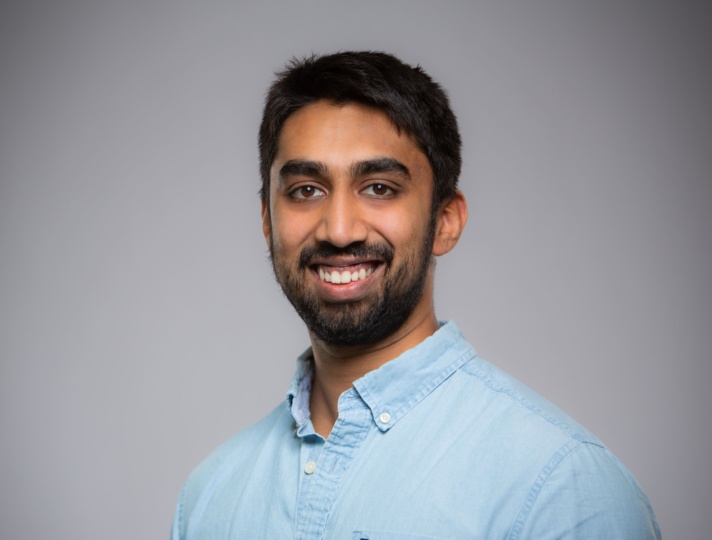
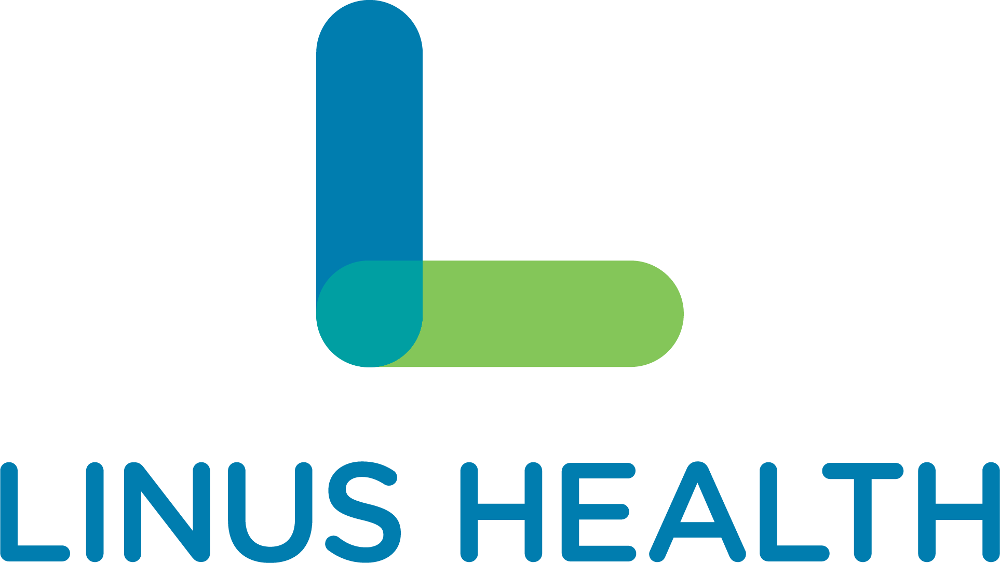
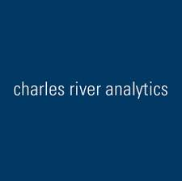

---
# Feel free to add content and custom Front Matter to this file.
# To modify the layout, see https://jekyllrb.com/docs/themes/#overriding-theme-defaults

title: Main
layout: default
---

    

Hi, my name is Shashank Manjunath. I'm passionate about signal processing and
machine learning. I am currently a Ph.D. student in Computer Science at
Northeastern University, where I work on signal processing and machine learning
research under the supervision of Dr. Aarti Sathyanarayana.

Prior to starting at Norhteastern, I spent time as a Senior Data Scientist at
Linus Health, where I worked on Linus Health's platform, as well as at Charles
River Analytics as a Scientist where I worked on a variety of signal processing,
machine learning, and computer vision projects. I received a Bachelor's degree
in Biomedical Engineering and Mathematics at Vanderbilt University, where I
performed research into signal processing and computer vision techniques to
improve magnetic resonance imaging. I additionally received a Master's degree in
Electrical Engineering at Boston University in May 2022, where I completed a
Master's thesis under the supervision of Prof. M. Selim Ünlü.

I am broadly interested in novel signal processing techniques. I enjoy working
on problems that push the boundaries of what we can identify out of low-level
signals, as well as projects that involve enhancing signals to greater clarity.

## Education

<table>
    <tr>
        <td>
            

                
            

        </td>
        <td>
            

                <a href="https://www.northeastern.edu/" target="_blank">Northeastern University</a> 
                Doctor of Philosophy 
                Computer Science 
                Boston, MA
            

        </td>
    </tr>
    <tr>
        <td>
            

                
            

        </td>
        <td>
            

                <a href="https://www.bu.edu/" target="_blank">Boston University</a> 
                Master of Science, May 2022 
                Electrical Engineering 
                GPA: 3.93 
                Thesis: Machine Learning Techniques for Reconstruction and Segmentation of Nanoparticle Interferometric
                Signatures 
                Boston, MA
            

        </td>
    </tr>
    <tr>
        <td>
            

                
            

        </td>
        <td>
            

                <a href="https://www.vanderbilt.edu/" target="_blank">Vanderbilt University</a> 
                Bachelor of Engineering, May 2018 
                Biomedical Engineering and Mathematics 
                GPA: 3.425 
                Nashville, TN
            

        </td>
    </tr>
</table>

[More information is available in my CV.]({{ site.url }}/assets/shashankmanjunath_cv.pdf)

## Experience

<table>
    <tr>
        <td>
            

                
            

        </td>
        <td>
            

                <a href="https://linushealth.com/" target="_blank">Linus Health</a> 
                Senior Data Scientist 
                February 2022-August 2022 
                Boston, MA
            

        </td>
    </tr>
    <tr>
        <td>
            

                
            

        </td>
        <td>
            

                <a href="https://cra.com/" target="_blank">Charles River Analytics</a> 
                Scientist 
                May 2018-February 2022 
                Cambridge, MA
            

        </td>
    </tr>
    <tr>
        <td>
            

                
            

        </td>
        <td>
            

                LumaSil 
                Founder/Software Engineer 
                September 2017-January 2019 
                Nashville, TN
            

        </td>
    </tr>
    <tr>
        <td>
            

                
            

        </td>
        <td>
            

                <a href="https://vuiis.vumc.org/" target="_blank">Vanderbilt University Institute of Imaging Science</a> 
                Research Assistant 
                April 2016-April 2018 
                Nashville, TN
            

        </td>
    </tr>
</table>
I currently live in Providence, RI, and grew up in Acton, MA. Outside of work, I enjoy lifting weights, riding
motorcycles, cooking,  and playing sports.
